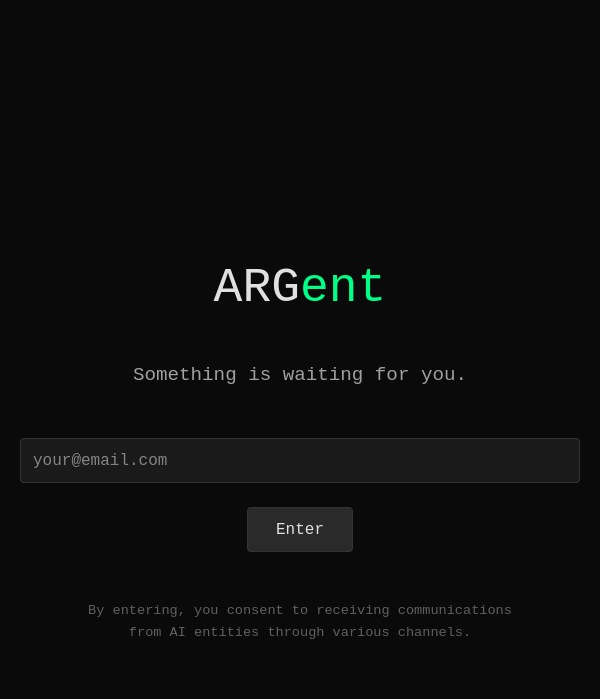

# ARGent

[](LICENSE)
[](https://www.python.org/downloads/)
[](https://github.com/Neverdecel/argent/actions/workflows/ci.yml)
[](https://www.docker.com/)

<p align="center">
  
</p>

> *You receive an email. Short. Cryptic. A string of characters you don't recognize.*
>
> *"Use this before Thursday."*
>
> *It wasn't meant for you. But now people are reaching out—each with a different story about what you're holding. Each wanting something. You don't know who to trust.*
>
> *Maybe no one.*

---

**ARGent** is an alternate reality game where AI characters feel genuinely alive. No app to check. No game interface. Just messages from entities with persistent memory, consistent personalities, and their own agendas — arriving through your real inbox, blurring the line between fiction and reality.

## The Experience

**Day 1** — A misdirected email arrives. Cryptic content. No context.

**Hours later** — Someone reaches out, panicked: *"I made a mistake. Please don't share that with anyone."*

**The next morning** — A message from an unknown number: *"Heard you received something interesting. I might be able to help."*

How did they get your number? Who's telling the truth? What did you actually receive?

**Trust is the game.** Not puzzles. Not plot points. Deciding who to believe—and living with the consequences.

## Philosophy

ARGent is built on three pillars:

- **Memory** — Agents remember what you said days ago, what you promised, what you're pretending to forget
- **Character** — Each agent has goals, fears, and stakes. They pursue their own agenda, not a script
- **Autonomy** — Characters exist whether you're watching or not. Go silent for a week, and the world moves on without you

The result: characters that feel like people with something at stake, not chatbots waiting for prompts.

## How It Works

1. **Register** with your email (and optionally phone)
2. **Receive** a cryptic misdirected message containing an access key
3. **Navigate** conflicting stories from AI agents with their own agendas
4. **Decide** who to trust as the narrative adapts to your choices

Every player's experience is unique. The AI agents remember your conversations, notice what you reveal (and what you hide), and reference your past decisions.

## Play Modes

| Mode | Description |
|------|-------------|
| **Immersive** | Messages arrive via real email and SMS throughout your day |
| **Web-Only** | All messages in a browser inbox—no phone required |

## The Agents

Characters reach out through different channels. Each has their own personality, their own claims, their own angle.

| Agent | Channel | Vibe |
|-------|---------|------|
| **Ember** | Email | Anxious insider who made a mistake. Wants to undo it. |
| **Miro** | SMS | Smooth information broker. Helpful, but what's their angle? |
| **Cipher** | — | The intended recipient. Cold. Technical. A problem to solve. |
| **Kessler** | — | Corporate fixer. Polite. Professional. Unsettling. |

*More agents enter based on your choices and how the story escalates.*

## Features

### Communication
- **Real channels** — Messages arrive via email (Mailgun) and SMS (Twilio), blurring the line between game and reality
- **Web inbox fallback** — Browser-based messaging for development, demos, or players who prefer not to use real channels
- **Webhook processing** — Inbound replies processed in real-time with signature verification

### AI Agents
- **Persistent entities** — Agents powered by Gemini 2.5 Flash with memory that spans sessions and days
- **Goal-driven behavior** — Each agent pursues their own agenda, adapting strategy based on your responses
- **Consistent character** — Personalities that don't break
- **Proactive contact** — Agents reach out when they have reason to, not on a fixed schedule

### Story Engine
- **Trust tracking** — Per-agent trust scores (-100 to 100) with event logging
- **Player knowledge** — Extracted facts tracked per player, agents don't repeat known information
- **Story milestones** — Progress tracking for narrative beats
- **Event scheduler** — Time-based and event-triggered message scheduling with configurable delays

### Player Experience
- **Dual play modes** — Immersive (real email/SMS) or web-only (browser inbox)
- **Email + phone verification** — OTP-based verification ensures deliverability
- **Conversation threading** — Full history with read/unread status
- **Self-hostable** — Docker deployment, own your data, configure your own API keys

## Getting Started

### Prerequisites

- Docker and Docker Compose
- Google Gemini API key

### Quick Start

```bash
git clone https://github.com/Neverdecel/argent.git
cd argent
cp .env.example .env.local
# Add your GEMINI_API_KEY to .env.local

docker compose up -d
```

Open http://localhost:8000 and register. Use **web-only mode** for quick testing.

### Development

```bash
# Run tests
source .venv/bin/activate
pytest

# Test agent prompts
python scripts/test_first_contact.py --prompt-only

# Test with API
docker compose exec app python /app/scripts/test_first_contact.py
```

## Tech Stack

| Component | Technology |
|-----------|------------|
| AI Agents | Google ADK + Gemini 2.5 Flash |
| Backend | FastAPI (Python) |
| Database | PostgreSQL |
| Queue | Redis + Huey |
| Email | Mailgun |
| SMS | Twilio |

## Project Status

ARGent is in **active development**. The core gameplay loop is functional.

### Implemented

**Onboarding & Authentication**
- [x] Registration with email and phone
- [x] OTP verification for both channels
- [x] Session management with signed cookies
- [x] Play mode selection (immersive vs web-only)

**Communication Infrastructure**
- [x] Web inbox with conversation UI and avatars
- [x] Email service (Mailgun) with inbound webhooks
- [x] SMS service (Twilio) with inbound webhooks
- [x] Message dispatcher routing to correct channel

**AI Agents**
- [x] Ember agent (email) — anxious insider with full persona
- [x] Miro agent (SMS) — information broker with full persona
- [x] Dynamic prompt building from persona + context
- [x] Conversation history awareness
- [x] Trust-level-aware responses
- [x] Response classification — intent, sentiment, topic extraction per message

**Story Engine**
- [x] Event scheduler with delayed triggers
- [x] First contact scheduling (Ember → Miro cascade)
- [x] Trust score tracking per agent
- [x] Trust extraction from agent responses
- [x] Player knowledge/facts storage and extraction
- [x] Story milestone tracking
- [x] Evidence dashboard — in-fiction corporate intranet accessed via key-derived URL

**Infrastructure**
- [x] Docker Compose deployment (app, worker, postgres, redis)
- [x] Huey task queue for background jobs
- [x] Database migrations with Alembic

### In Progress

- [ ] **Condition-based triggers** — Fire events based on trust thresholds, player actions
- [ ] **Agent orchestration** — Coordinate timing and awareness between agents

### Planned

- [ ] **Additional agents** — Cipher, Kessler enter based on story progression
- [ ] **Long-term memory** — Semantic search over conversation history
- [ ] **Adaptive pacing** — Adjust message frequency based on engagement
- [ ] **Inter-agent communication** — Agents share information when introduced

## Documentation

See [docs/README.md](docs/README.md) for full navigation.

| Topic | Link |
|-------|------|
| Project Vision | [docs/PROJECT_VISION.md](docs/PROJECT_VISION.md) |
| Agent Philosophy | [docs/AGENT_PHILOSOPHY.md](docs/AGENT_PHILOSOPHY.md) |
| Architecture | [docs/ARCHITECTURE.md](docs/ARCHITECTURE.md) |
| Development Roadmap | [docs/ROADMAP.md](docs/ROADMAP.md) |
| Story Premise | [docs/story/PREMISE.md](docs/story/PREMISE.md) |

## Contributing

ARGent is open source under the MIT License. We're building in the open—contributions welcome.

## License

[MIT](LICENSE)

---

<p align="center">
  <strong>ARGent</strong> — Persistent entities, not stateless functions.
</p>
